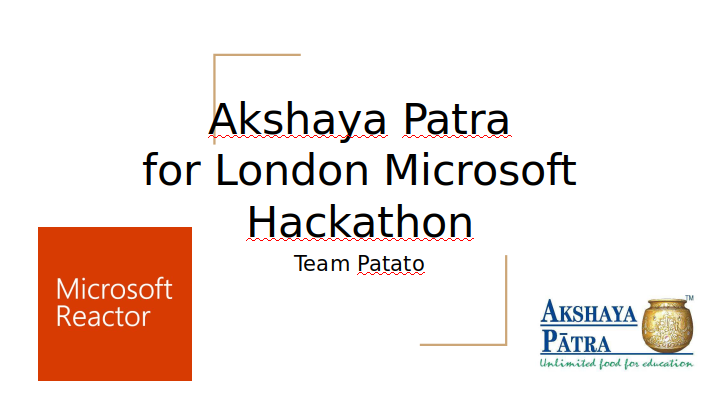
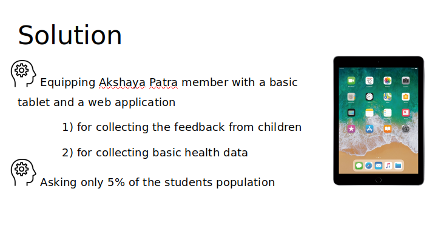
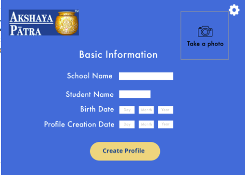

# Akshaya_Patra_MS_Hackathon
Project for an 8 hour Akshaya Patra London hackathon organized by Microsoft Reactor.
The main problem to be solved was malnutrition of children in India: collecting the feedback about the meals and gathering medical data about children.
Our solution: equipping every NGO employee visitng a school with a tablet and a basic webapp.
The webapp was not finished due to lack of time - we presented only a proof of concept.

